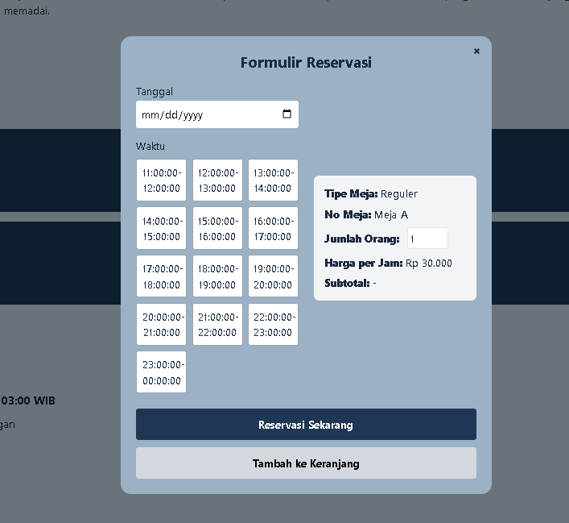

# Web-Based Billiard Table Booking and Reservation Application

This web application is used to make billiard table reservations online. Users can choose the type of table (Regular, VIP, Platinum), select a schedule, and place a booking. The purpose of this application is to simplify the reservation process and avoid queues at the venue.

## Screenshots

### Homepage


### Pop-UP Form



## Run Locally

Clone the project

```bash
  git clone https://github.com/grace031105/s_billiard
```

Go to the project directory

```bash
  cd s_billiard
```

Install dependencies

```bash
  npm install
```

Start the server

```bash
  npm run start
```


## Demo

http://localhost:8000/dash-public

## YouTube Channel

- [Lihat di YouTube](https://youtu.be/iaSmGD0ZnLg?si=aEFQYLz60RahhPAf)